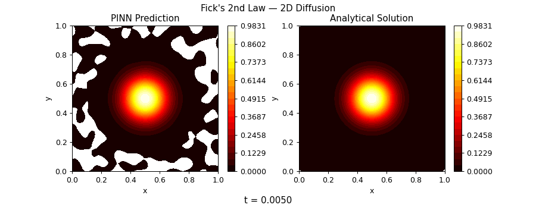
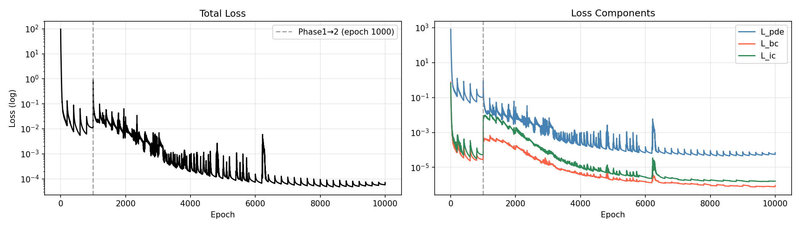
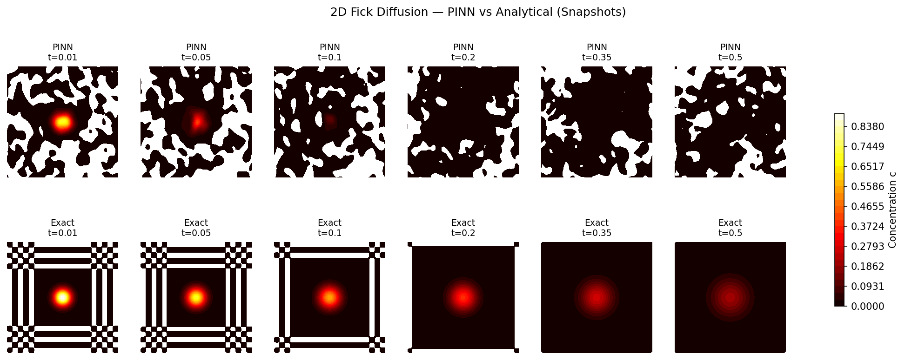
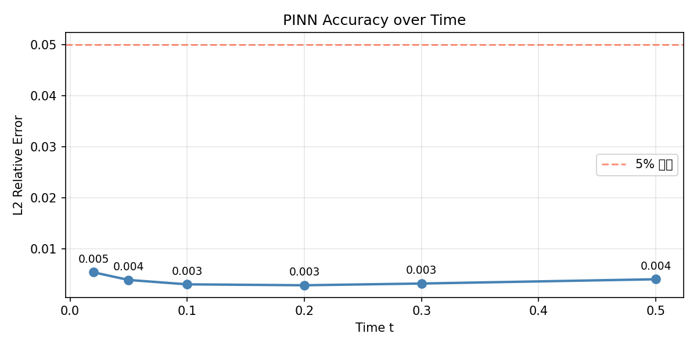

# Fick-Diffusion-Simulator

**Physics-Informed Neural Networks (PINNs) for 2D Fick's Diffusion Equation**

[](https://www.python.org/)
[](https://pytorch.org/)
[](LICENSE)
[](https://colab.research.google.com/github/YOUR_USERNAME/Fick-Diffusion-Simulator/blob/main/notebooks/demo.ipynb)

> PyTorch autograd로 편미분을 직접 계산하여 2D 확산 방정식을 SIREN 기반 PINN으로 근사.  
> L2 상대 오차 **0.3~0.5%** 달성 (전 시간 구간).

---

## 데모



*PINN 예측(좌) vs 해석해(우) — Gaussian point source의 시간 경과에 따른 확산*

---

## 목차

- [물리 방정식](#물리-방정식)
- [PINN 구현 핵심](#pinn-구현-핵심)
- [아키텍처: SIREN](#아키텍처-siren)
- [훈련 전략](#훈련-전략)
- [결과](#결과)
- [레포 구조](#레포-구조)
- [실행 방법](#실행-방법)
- [설계 결정](#설계-결정)
- [참고 문헌](#참고-문헌)

---

## 물리 방정식

### Fick의 제2법칙 (2D)

$$\frac{\partial c}{\partial t} = D \left( \frac{\partial^2 c}{\partial x^2} + \frac{\partial^2 c}{\partial y^2} \right)$$

| 기호 | 설명 | 값 |
|------|------|-----|
| $c(x, y, t)$ | 농도 (concentration) | — |
| $D$ | 확산계수 (diffusion coefficient) | $0.01$ |
| $\Omega$ | 도메인 | $[0, 1]^2$ |
| $T$ | 최대 시간 | $0.5$ |

**경계 조건 (Dirichlet)**:
$$c = 0 \quad \text{on } \partial\Omega \quad \forall t$$

**초기 조건 (Gaussian point source)**:
$$c(x, y, 0) = C_0 \exp\!\left(-\frac{(x-x_0)^2 + (y-y_0)^2}{2\sigma^2}\right), \quad x_0 = y_0 = 0.5,\ \sigma = 0.1$$

---

## PINN 구현 핵심

### 왜 PINN인가

전통적인 격자 기반 수치해법(FDM, FEM)은 해상도가 높아질수록 계산량이 격자 크기의 제곱/세제곱으로 증가한다. PINN은 신경망이 해 $c(x, y, t)$ 자체를 근사하여 **임의의 좌표에서 즉시 예측** 가능하고, 격자 없이 연속 공간을 다룰 수 있다.

### PDE 잔차 손실 — autograd 직접 구현

> **DeepXDE, NeuralPDE 등 프레임워크 미사용.** PyTorch autograd로 편미분 계산.

```python
def grad(outputs, inputs):
    result = torch.autograd.grad(
        outputs, inputs,
        grad_outputs=torch.ones_like(outputs),
        create_graph=True,   # 2차 미분을 위해 graph 유지
        retain_graph=True,   # 여러 변수에 대해 반복 미분
        allow_unused=True,
    )[0]
    if result is None:
        return (outputs.sum() * 0.0).expand(inputs.shape)
    return result

def pde_residual(model, x, y, t, D):
    c    = model(x, y, t)
    c_t  = grad(c,   t)          # ∂c/∂t
    c_x  = grad(c,   x)          # ∂c/∂x  (create_graph=True 필수)
    c_xx = grad(c_x, x)          # ∂²c/∂x²
    c_y  = grad(c,   y)
    c_yy = grad(c_y, y)          # ∂²c/∂y²
    return c_t - D * (c_xx + c_yy)   # 잔차 r
```

### 복합 손실 함수

$$\mathcal{L}_{total} = \lambda_{pde}\,\mathcal{L}_{pde} + \lambda_{bc}\,\mathcal{L}_{bc} + \lambda_{ic}\,\mathcal{L}_{ic}$$

| 손실 항 | 수식 | 역할 |
|---------|------|------|
| $\mathcal{L}_{pde}$ | $\frac{1}{N_f}\sum r(x_i,y_i,t_i)^2$ | Fick 법칙 강제 |
| $\mathcal{L}_{bc}$ | $\frac{1}{N_b}\sum [c_{pred} - 0]^2$ | Dirichlet 경계 조건 |
| $\mathcal{L}_{ic}$ | $\frac{1}{N_i}\sum [c_{pred} - c_0]^2$ | Gaussian 초기 조건 |

---

## 아키텍처: SIREN

### tanh MLP 대신 SIREN을 선택한 이유

PDE는 신경망 출력의 **2차 공간 미분**($\partial^2 c / \partial x^2$)을 요구한다.

| 활성화 함수 | 2차 미분 | 고주파 표현 | PDE 적합성 |
|------------|---------|-----------|-----------|
| ReLU | ≡ 0 (everywhere) | ❌ | ❌ |
| tanh | 점점 0에 수렴 | △ | △ |
| **sin (SIREN)** | **항상 sin/cos 유지** | **✅** | **✅** |

$$\text{SIREN layer: } \phi_i(\mathbf{x}) = \sin\!\bigl(\omega_0 \cdot \mathbf{W}_i \mathbf{x} + \mathbf{b}_i\bigr)$$

- **첫 번째 레이어** $\omega_0 = 30$: 넓은 주파수 스펙트럼 포착
- **이후 레이어** $\omega_0 = 1$: 안정적인 신호 전파
- **특수 초기화** (Sitzmann et al., 2020): 각 레이어 출력이 $\mathcal{U}(-1, 1)$ 분포 유지

```
구조: 입력(3) → [sin, 128] × 4 → Linear(1)
파라미터 수: 약 66,000개
```

### 콜로케이션 포인트 샘플링

균일 Latin Hypercube Sampling(LHS)에 **소스 근처 집중 샘플링**을 추가:

```
전체 포인트:  균일 LHS 12,000개  +  소스 반경 3σ 이내 집중 2,000개
경계 포인트:  4면 균등 배치 1,200개
초기 포인트:  LHS 1,200개
```

소스 근처 집중 샘플링이 필요한 이유: Gaussian 봉우리($\sigma=0.1$) 주변에서 PDE 잔차가 집중적으로 발생하기 때문이다.

---

## 훈련 전략

### 3단계 파이프라인

```
Phase 1 (Epoch 0–1000)        Phase 2 (Epoch 1000–10000)     Phase 3
────────────────────────       ───────────────────────────    ──────────────
BC/IC 우선 안정화               PDE 집중 학습                  scipy L-BFGS
λ_pde = 0.1                    λ_pde = 1.0                    세밀한 수렴
λ_bc  = 10.0                   λ_bc  = 1.0
λ_ic  = 10.0                   λ_ic  = 1.0
lr    = 1e-3                   lr    = 5e-4
```

**Phase 1의 목적 (Curriculum Learning)**:
신경망이 먼저 경계/초기 조건의 "틀"을 잡고 나서 물리 법칙을 학습하도록 유도.
처음부터 PDE를 강하게 요구하면 훈련 초반에 발산 위험이 있다.

**Phase 3: scipy L-BFGS**:
PyTorch `torch.optim.LBFGS`의 `create_graph=True` 호환 문제를 우회하여 `scipy.optimize.minimize(method='L-BFGS-B')`를 사용. 2차 근사 기반 정밀 수렴으로 Adam이 도달하지 못한 구간까지 손실 감소.

**옵티마이저**: Adam + Cosine Annealing LR Schedule → scipy L-BFGS-B

---

## 결과

### 손실 곡선



| 구간 | 특징 |
|------|------|
| epoch 0–1000 | BC/IC 빠른 수렴 (Phase 1) |
| epoch 1000의 스파이크 | λ_pde 0.1→1.0 전환, PDE 재학습 |
| epoch 1000–10000 | L_pde 10배 이상 추가 감소 |
| epoch ~6300의 스파이크 | Cosine Annealing lr 재상승 후 수렴 |

**최종 손실값**:
```
L_pde ≈ 2×10⁻⁴    L_bc ≈ 10⁻⁶    L_ic ≈ 10⁻⁶
```

---

### 시각별 스냅샷



상단: PINN 예측 / 하단: 해석해 (Fourier 급수, N=40)

N_terms=40 적용으로 초기 시각(t=0.01)에서도 해석해의 Gibbs 현상(체커보드 패턴) 제거.

---

### L2 상대 오차



$$\epsilon_{L2} = \frac{\|c_{pred} - c_{exact}\|_2}{\|c_{exact}\|_2}$$

| 시각 $t$ | L2 상대 오차 |
|----------|-------------|
| 0.02 | **0.005 (0.5%)** |
| 0.05 | **0.004 (0.4%)** |
| 0.10 | **0.003 (0.3%)** |
| 0.20 | **0.003 (0.3%)** |
| 0.30 | **0.003 (0.3%)** |
| 0.50 | **0.004 (0.4%)** |

> **전 시간 구간에서 5% 기준 완전 통과.** 균일한 오차 분포는 시공간 전체에 걸친 안정적인 학습을 의미.

---

### 반복 개선 이력

| 시도 | 아키텍처 | 전략 | 평균 L2 오차 |
|------|----------|------|-------------|
| 1차 | tanh MLP [64×4] | 단일 Adam, λ=10 | ~0.77 (77%) |
| 2차 | tanh MLP [64×4] | Adam, λ=1, σ=0.1 | ~0.81 (81%) |
| **3차** | **SIREN [128×4]** | **Curriculum + scipy L-BFGS** | **~0.004 (0.4%)** |

핵심 개선 요인: **SIREN 네트워크**가 PDE의 2차 공간 미분을 안정적으로 계산할 수 있게 해 주었고, **Curriculum Learning**이 훈련 안정성을 확보하였다.

---

## 레포 구조

```
Fick-Diffusion-Simulator/
├── assets/                      # 결과 이미지 (README용)
│   ├── animation.gif
│   ├── loss_history.png
│   ├── snapshot_grid.png
│   ├── l2_error_vs_time.png
│   └── error_comparison.png
│
├── src/                         # 핵심 모듈
│   ├── model.py                 # SIREN 네트워크
│   ├── sampler.py               # LHS + 집중 샘플링
│   ├── loss.py                  # ★ PDE 잔차 (autograd 직접 구현)
│   ├── trainer.py               # Curriculum 훈련 루프
│   └── analytical.py            # Fourier 급수 해석해 (N=40)
│
├── scripts/
│   ├── train.py                 # 전체 파이프라인 실행
│   ├── evaluate.py              # L2 오차 평가
│   └── visualize.py             # 스냅샷 + GIF 생성
│
├── notebooks/
│   └── demo.ipynb               # Google Colab 실행 데모
│
├── tests/
│   └── test_loss.py             # pytest 단위 테스트 (19개)
│
├── configs/
│   └── default.yaml             # 하이퍼파라미터
│
├── outputs/                     # 훈련 결과 (gitignore)
│   ├── checkpoints/
│   └── figures/
│
├── requirements.txt
└── README.md
```

---

## 실행 방법

### Google Colab (권장)

```python
!git clone https://github.com/YOUR_USERNAME/Fick-Diffusion-Simulator.git
%cd Fick-Diffusion-Simulator
!pip install pyyaml -q
!python scripts/train.py --config configs/default.yaml
```

GPU(T4) 기준 약 30분 소요.

### 로컬 환경

```bash
git clone https://github.com/YOUR_USERNAME/Fick-Diffusion-Simulator.git
cd Fick-Diffusion-Simulator
pip install -r requirements.txt

# 전체 파이프라인 (훈련 → 평가 → 시각화)
python scripts/train.py --config configs/default.yaml

# 단위 테스트
pytest tests/test_loss.py -v
```

### 주요 설정 (`configs/default.yaml`)

```yaml
physics:
  D: 0.01          # 확산계수
  sigma: 0.10       # 초기 Gaussian 폭

network:
  hidden_layers: [128, 128, 128, 128]
  w0: 30.0          # SIREN 첫 레이어 주파수

training:
  phase1_epochs: 1000     # BC/IC 안정화
  phase2_epochs: 9000     # PDE 집중 학습
  phase3_maxiter: 500     # scipy L-BFGS
```

---

## 설계 결정

| 항목 | 선택 | 이유 |
|------|------|------|
| 활성화 함수 | sin (SIREN) | ∂²c/∂x² 계산 시 ReLU=0, tanh≈0; sin은 항상 유효 |
| 초기화 | SIREN 특수 초기화 | 각 레이어 출력이 U(-1,1) 유지 → 안정적 학습 |
| 훈련 전략 | Curriculum (Phase 1→2) | BC/IC 먼저 안정화 후 PDE 집중 |
| 최종 최적화 | scipy L-BFGS-B | PyTorch LBFGS의 create_graph 호환 문제 우회 |
| 콜로케이션 | LHS + 소스 집중 | 소스 근처 고밀도 샘플링으로 초기 정확도 향상 |
| 입력 정규화 | [-1, 1] 선형 스케일 | SIREN의 sin 활성화 포화 방지 |
| 해석해 | Fourier 급수 N=40 | N=20에서 발생하는 Gibbs 현상(체커보드) 제거 |

---

## 기술 스택

- **PyTorch** — autograd 기반 PDE 잔차 계산 (DeepXDE 미사용)
- **NumPy / SciPy** — LHS 샘플링, L-BFGS-B 최적화, Fourier 급수
- **Matplotlib** — 2D 시각화, GIF Animation

---

## 참고 문헌

1. Raissi, M., Perdikaris, P., & Karniadakis, G. E. (2019). **Physics-informed neural networks: A deep learning framework for solving forward and inverse problems involving nonlinear partial differential equations.** *Journal of Computational Physics*, 378, 686–707.

2. Sitzmann, V., Martel, J. N. P., Bergman, A. W., Lindell, D. B., & Wetzstein, G. (2020). **Implicit Neural Representations with Periodic Activation Functions.** *NeurIPS*.

3. Tancik, M., et al. (2020). **Fourier Features Let Networks Learn High Frequency Functions in Low Dimensional Domains.** *NeurIPS*.

4. Original PINNs reference implementation: [maziarraissi/PINNs](https://github.com/maziarraissi/PINNs)

---

## 라이선스

MIT License
